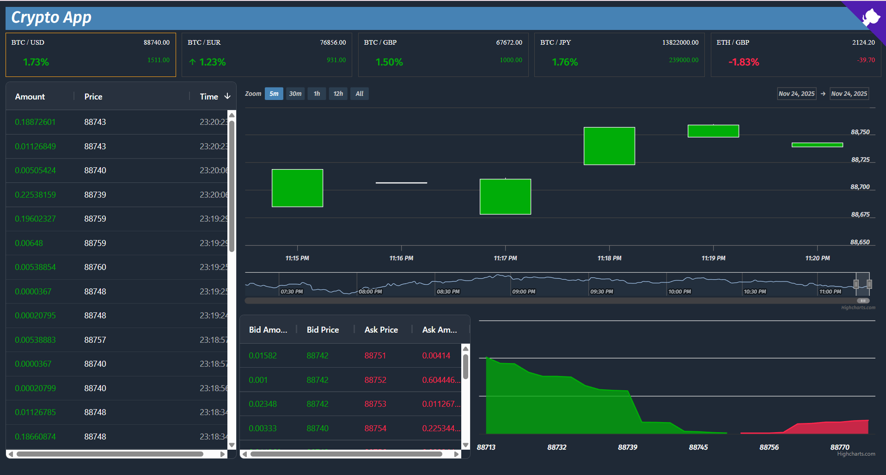

# 🚀 CryptoApp

A real-time cryptocurrency trading dashboard built with React 19, TypeScript, and Redux Toolkit for learning purposes. This is a course project designed to demonstrate how modern web technologies work together in a financial application. While robust and well-structured, there's plenty of room for improvement and enhancement.



## ✨ Core Features

### 📊 **Real-Time Trading Interface**

- **Bitfinex API Integration**: Direct WebSocket API v2 connection for live market data
- **Redux Thunk Async Operations**: Professional async subscription management
- **Interactive Candlestick Charts**: Highcharts with zoom, navigation, and technical analysis
- **Live Order Book**: Real-time bid/ask spreads with market depth visualization
- **Trade Feed**: Animated real-time trade history with color-coded buy/sell indicators
- **Market Overview**: Comprehensive ticker grid with price changes and mini charts

### 🛡️ **Production-Ready Architecture**

- **Handler-Based Processing**: Modular WebSocket message handlers for maintainability
- **Memory Management**: Configurable limits preventing memory leaks
- **Connection Monitoring**: Real-time latency tracking and diagnostics
- **Environment Configuration**: Flexible deployment settings via .env
- **Comprehensive Testing**: Vitest with 80%+ coverage and handler unit tests
- **Type Safety**: Enhanced TypeScript strict mode configuration

### 🎨 **Modern UI/UX**

- **Responsive Design**: Adaptive grid layout for all screen sizes
- **Dark Theme**: Professional trading interface with smooth animations
- **Component Library**: Reusable UI components with consistent styling
- **Loading States**: Animated loading indicators and skeleton screens
- **Update Highlighting**: Visual feedback for real-time data changes

## 🛠️ Tech Stack

### **Core Technologies**

- **Frontend**: React 19, TypeScript 5.9, Vite 7.2
- **State Management**: Redux Toolkit 2.0 with Redux Thunk
- **API Integration**: Bitfinex WebSocket API v2
- **Styling**: Styled Components 6.1 with custom theme system
- **Charts**: Highcharts 12.4 & Highcharts React
- **Data Grid**: AG Grid Community 34.3

### **Development & Testing**

- **Testing**: Vitest 2.1 with React Testing Library and comprehensive handler tests
- **Type Safety**: Enhanced TypeScript strict mode with noUncheckedIndexedAccess
- **Code Quality**: ESLint 9.39.1, Prettier 3.6.2 (available via npm scripts, not enforced)
- **Build Tool**: Vite 7.2 with optimized production builds

### **Utilities & Libraries**

- **Data Processing**: Lodash 4.17, Luxon 3.7, Numeral 2.0
- **Custom Hooks**: useGridResize, useLatest, usePrevious, useThrottle
- **Monitoring**: Built-in connection diagnostics and latency tracking

## 🚀 Quick Start

### **1. Installation**

```bash
# Clone repository
git clone <repository-url>
cd cryptoapp

# Install dependencies
npm install
```

### **2. Environment Setup**

```bash
# Create environment file
cp .env.example .env

# Configure settings (optional)
# VITE_BITFINEX_WS_URL=wss://api-pub.bitfinex.com/ws/2
# VITE_MAX_TRADES=1000
# VITE_LOG_LEVEL=info
```

### **3. Development**

```bash
# Start development server
npm run dev

# Run tests (optional)
npm run test

# Open browser
# http://localhost:5173
```

### **4. Production Build**

```bash
# Build optimized version
npm run build

# Preview production build
npm run preview
```

## 📁 Project Architecture

```
src/
├── config/             # Environment configuration
│   └── env.ts          # Centralized config management
├── core/               # Core utilities and components
│   ├── components/     # Reusable UI components
│   │   ├── AnimatedCube/ # 3D loading animations
│   │   ├── Diagnostics/  # Connection monitoring
│   │   ├── LineChart/    # Mini price charts
│   │   ├── Loading/      # Loading states
│   │   ├── Stale/        # Stale data indicators
│   │   ├── TrendIndicator/ # Price trend arrows
│   │   ├── UpdateHighlight/ # Value change animations
│   │   └── Widget/       # Container components
│   ├── hooks/          # Custom React hooks
│   │   ├── useGridResize.ts
│   │   ├── useLatest.ts
│   │   ├── usePrevious.ts
│   │   └── useThrottle.ts
│   ├── transport/      # WebSocket infrastructure
│   │   ├── handlers/   # Message processing handlers
│   │   │   ├── bookHandler.ts
│   │   │   ├── candlesHandler.ts
│   │   │   ├── subscriptionHandlers.ts
│   │   │   ├── tickerHandler.ts
│   │   │   └── tradesHandler.ts
│   │   ├── types/      # WebSocket type definitions
│   │   │   ├── ActionTypes.ts
│   │   │   ├── Channels.ts
│   │   │   ├── ConnectionProxy.ts
│   │   │   ├── ConnectionStatus.ts
│   │   │   └── SubscribeMsg.ts
│   │   ├── Connection.ts
│   │   ├── WsConnectionProxy.ts
│   │   ├── wsMiddleware.ts
│   │   ├── staleMonitor.ts
│   │   ├── slice.ts
│   │   └── selectors.ts
│   ├── utils.ts        # Core utility functions
│   └── utils.test.ts   # Core utilities tests
├── modules/            # Feature modules (Domain-driven design)
│   ├── ag-grid/        # Data grid formatters
│   │   ├── formatter.ts
│   │   └── formatter.test.ts
│   ├── app/           # Application bootstrap
│   │   └── slice.ts
│   ├── book/          # Order book & depth chart
│   │   ├── components/
│   │   │   ├── Book/
│   │   │   └── DepthChart/
│   │   ├── types/
│   │   ├── selectors.ts
│   │   └── slice.ts
│   ├── candles/       # Candlestick charts
│   │   ├── components/
│   │   ├── types/
│   │   ├── selectors.ts
│   │   ├── slice.ts
│   │   └── utils.ts
│   ├── common/        # Shared components
│   │   └── AnimatedContent/
│   ├── ping/          # Latency monitoring
│   │   ├── components/
│   │   │   └── Latency/
│   │   ├── selectors.ts
│   │   └── slice.ts
│   ├── redux/         # Store configuration
│   │   └── store.ts
│   ├── reference-data/ # Currency pair management
│   │   ├── selectors.ts
│   │   ├── slice.ts
│   │   └── utils.ts
│   ├── selection/     # Selected pair state
│   │   ├── selectors.ts
│   │   └── slice.ts
│   ├── tickers/       # Price tickers & market data
│   │   ├── components/
│   │   │   ├── Market/
│   │   │   ├── Ticker/
│   │   │   └── Tickers/
│   │   ├── types/
│   │   ├── selectors.ts
│   │   └── slice.ts
│   └── trades/        # Trade history
│       ├── components/
│       ├── types/
│       ├── selector.ts
│       └── slice.ts
├── theme/             # Styling system
│   ├── fonts/         # Font files (Fira Sans, Material Icons)
│   ├── fonts.css      # Font definitions
│   ├── Highchart.ts   # Chart theme configuration
│   └── style.ts       # Theme configuration
├── App.styled.ts      # Main app styling
├── App.tsx            # Main application
├── GithubLink.tsx     # GitHub repository link
├── index.css          # Global styles
├── index.tsx          # Application entry point
├── react-app-env.d.ts # React type definitions
├── serviceWorker.ts   # Service worker registration
└── setupTests.ts      # Test configuration
```

## 🎨 Feature Deep Dive

### 🔌 **Bitfinex API Integration**

- **WebSocket API v2**: Direct connection to `wss://api-pub.bitfinex.com/ws/2`
- **Handler-Based Processing**: Modular handlers for trades, tickers, candles, and book data
- **Auto-Reconnection**: Exponential backoff with connection recovery
- **Redux Thunk Orchestration**: Async subscription management with staggered timing
- **Subscription Management**: Channel lifecycle with stale detection
- **Rate Limiting**: 2-second intervals between subscriptions to respect API limits

### 📈 **Advanced Charting**

- **Professional Candlestick Charts**: Highcharts with OHLC data visualization
- **Interactive Navigation**: Zoom, pan, and range selection
- **Market Depth Charts**: Order book visualization with bid/ask curves
- **Mini Charts**: Embedded price trends in ticker components
- **Real-time Updates**: Smooth data streaming without chart rebuilds
- **Dark Theme Integration**: Consistent styling across all chart types

### 📊 **Trading Interface**

- **Live Order Book**: Real-time bid/ask spreads with price aggregation
- **Trade Feed**: Chronological trade history with buy/sell indicators
- **Market Overview**: Multi-currency ticker grid with performance metrics
- **Price Alerts**: Visual highlighting for significant price movements
- **Data Validation**: Runtime type checking for all financial data

### ⚡ **Performance & Reliability**

- **Memory Management**: Environment-configurable limits for trades (1000) and candles (5000)
- **Handler Architecture**: Modular message processing for maintainability
- **Order Book Batching**: 50ms batching for high-frequency updates to prevent AG Grid performance issues
- **Connection Monitoring**: Real-time latency tracking with ping/pong mechanism
- **Stale Detection**: Heartbeat-based monitoring (20s timeout) with visual indicators
- **Memoized Selectors**: Optimized data access preventing unnecessary re-renders
- **Connection Diagnostics**: WebSocket health monitoring with auto-reconnection (5 attempts, exponential backoff)
- **Null Safety**: Comprehensive null/NaN checks in AG Grid formatters

### 🎯 **Developer Experience**

- **Comprehensive Testing**: Vitest with handler unit tests and 80%+ coverage
- **Type Safety**: Enhanced TypeScript strict mode with advanced compiler options
- **Environment Configuration**: Flexible deployment via environment variables
- **Handler Testing**: Individual unit tests for each WebSocket message handler
- **Code Quality**: ESLint and Prettier available via npm scripts (manual execution)
- **Documentation**: Extensive API documentation and architecture guides

## ⚙️ Configuration

### Environment Variables

Create `.env` file for configuration:

```bash
# API Configuration
VITE_BITFINEX_WS_URL=wss://api-pub.bitfinex.com/ws/2

# Performance Tuning
VITE_MAX_TRADES=1000
VITE_MAX_CANDLES=5000

# Logging
VITE_LOG_LEVEL=info
```

### Handler-Based Architecture

```typescript
// Modular message handlers
export const handleTradesData = (parsedData: any[], subscription: any, dispatch: AppDispatch) => {
  const currencyPair = subscription.request.symbol.slice(1)

  if (Array.isArray(parsedData[1])) {
    // Snapshot data with memory management
    const trades = parsedData[1].map(transformTrade).sort((a, b) => a.timestamp - b.timestamp)

    dispatch(tradesSnapshotReducer({ currencyPair, trades }))
  } else {
    // Single trade update
    const trade = transformTrade(parsedData[1])
    dispatch(tradesUpdateReducer({ currencyPair, trade }))
  }
}

// Store configuration with handler middleware
const store = configureStore({
  reducer: {
    app: appBootstrapSlice.reducer,
    trades: tradesSlice.reducer,
    subscriptions: subscriptionsSlice.reducer,
    // ... other reducers
  },
  middleware: (getDefaultMiddleware) =>
    getDefaultMiddleware({
      thunk: { extraArgument: { connection } },
    }).concat(createWsMiddleware(connection)),
})
```

### Theme System

```typescript
// src/theme/style.ts
const Palette = {
  BackgroundColor: "#1f2936",
  Positive: "#00AD08", // Green for gains
  Negative: "#FF264D", // Red for losses
  Bid: "#00AD08", // Buy orders
  Ask: "#FF264D", // Sell orders
  Orange: "#FFA41B", // Accent color
  White: "#FFF",
  Border: "#424242",
}

// Font system with Fira Sans
// Custom fonts: Fira Sans (Regular, Bold, Light, Medium, Italic variants)
// Material Icons for UI elements
```

## 📦 Available Scripts

### Development

- `npm run dev` - Start development server with hot reload
- `npm run preview` - Preview production build locally

### Testing

- `npm run test` - Run unit tests with Vitest
- `npm run test:ui` - Run tests with interactive UI
- `npm run test:coverage` - Generate test coverage report

### Build & Deploy

- `npm run build` - Production build (TypeScript + Vite optimization)
- `npm run lint` - Run ESLint with TypeScript support
- `npm run format` - Format code with Prettier

### Quality Assurance

```bash
# Run full quality check
npm run lint && npm run test && npm run build
```

## 🌟 Component Architecture

### **Core Components**

- **CandlesChart**: Professional candlestick charts with Highcharts integration
- **Market**: Real-time market data with performance metrics
- **Tickers**: Responsive grid with mini charts and trend indicators
- **Trades**: Live trade feed with color-coded buy/sell animations
- **Book**: Order book with real-time bid/ask spread visualization
- **DepthChart**: Market depth curves with interactive price levels

### **Infrastructure Components**

- **Diagnostics**: WebSocket connection monitoring and health checks
- **Latency**: Real-time ping monitoring with performance alerts
- **AnimatedContent**: Smooth transitions and loading states
- **UpdateHighlight**: Value change animations for price updates
- **Widget**: Consistent container components with titles and styling

### **Custom Hooks**

- **useGridResize**: Responsive grid layout handling
- **useThrottle**: Performance optimization for high-frequency updates
- **usePrevious**: State comparison for change detection

## 🚀 Performance Features

### **Memory Management**

- **Configurable Limits**: Environment variables control data retention (MAX_TRADES=1000, MAX_CANDLES=5000)
- **Automatic Cleanup**: Reducers prevent unbounded array growth
- **Staggered Subscriptions**: 2-second intervals prevent API overload

### **Architecture Benefits**

- **Handler-Based Processing**: Modular WebSocket message handling for maintainability
- **Connection Monitoring**: Built-in latency tracking via Diagnostics and Latency components
- **Type Safety**: Enhanced TypeScript strict mode prevents runtime errors
- **Testing Coverage**: Comprehensive Vitest test suite with handler unit tests

## 🧪 Testing Strategy for the Students to Implement

### **Test Coverage**

- **Unit Tests**: 80%+ coverage for critical business logic
- **Integration Tests**: WebSocket message handling and Redux flows
- **Component Tests**: UI behavior and user interactions
- **Performance Tests**: Memory usage and render time validation

### **Test Files**

```
├── slice.test.ts        # Redux state management
├── selectors.test.ts    # Data selection logic
├── handlers.test.ts     # WebSocket message processing
├── middleware.test.ts   # Redux middleware integration
├── formatter.test.ts    # Data formatting utilities
└── utils.test.ts        # Core utility functions
```

## 🏗️ Development Setup

### **Prerequisites**

- Node.js 24+ (LTS recommended)
- npm 11+ or yarn 3+
- Git for version control

### **Quick Start**

```bash
# Clone and setup
git clone <repository-url>
cd cryptoapp
npm install

# Environment configuration
cp .env.example .env
# Edit .env with your settings

# Start development
npm run dev
```

### **Development Workflow**

```bash
# Run tests during development
npm run test:watch

# Check code quality
npm run lint
npm run format

# Build and test production
npm run build
npm run preview
```

## 📊 Connection Monitoring

### **Built-in Diagnostics**

- **WebSocket Health**: Connection status tracking via `ConnectionStatus` enum
- **UI Latency**: Real-time UI thread responsiveness monitoring (every 2 seconds)
- **Network Latency**: WebSocket round-trip time via ping/pong mechanism
- **Stale Detection**: Heartbeat-based monitoring detecting inactive subscriptions after 20 seconds
- **Visual Indicators**: Stale overlays on Book, DepthChart, Trades, Candles, and Market components
- **Auto-Reconnection**: Exponential backoff with up to 5 reconnection attempts

### **Stale Detection Implementation**

```typescript
// Stale Monitor - checks every 5 seconds
const STALE_TIMEOUT_MS = 20000 // 20 seconds without heartbeat = stale
const STALE_CHECK_INTERVAL_MS = 5000 // Check every 5 seconds

export const startStaleMonitor = (getState: () => RootState, dispatch: AppDispatch) => {
  const intervalId = setInterval(() => {
    const state = getState()
    const now = Date.now()

    Object.keys(state.subscriptions).forEach((key) => {
      const channelId = Number(key)
      if (isNaN(channelId)) return

      const subscription = state.subscriptions[channelId]
      if (!subscription) return

      const { lastUpdate, isStale } = subscription

      if (lastUpdate && !isStale && now - lastUpdate > STALE_TIMEOUT_MS) {
        dispatch(markSubscriptionStale({ channelId }))
      }
    })
  }, STALE_CHECK_INTERVAL_MS)

  return () => clearInterval(intervalId)
}

// Heartbeat handling - resets stale flag
if (Array.isArray(parsedData) && parsedData[1] === "hb") {
  const [channelId] = parsedData
  const subscription = store.getState().subscriptions[channelId]
  if (subscription?.isStale) {
    store.dispatch(updateStaleSubscription({ channelId }))
  }
  return
}

// UI Components with stale indicators
const Book = ({ orders, isStale }: Props) => {
  return (
    <Container>
      {isStale && <Stale />}
      <AgGridReact rowData={orders} />
    </Container>
  )
}
```

### **Connection Monitoring Features**

```typescript
// Network Latency (Latency component)
const Latency = ({ latency }: Props) => {
  return <span>{latency || "---"}ms</span>
}

// Auto-Reconnection with exponential backoff
this.socket.onclose = () => {
  this.onCloseFn && this.onCloseFn()

  if (this.shouldReconnect && this.reconnectAttempts < this.maxReconnectAttempts) {
    this.reconnectAttempts++
    setTimeout(() => this.connect(), this.reconnectDelay * this.reconnectAttempts)
  }
}
```

## 📄 License

MIT License - see [LICENSE](LICENSE) file for details.

## 🤝 Contributing

### **Development Guidelines**

1. **Fork** the repository
2. **Create** feature branch (`git checkout -b feature/amazing-feature`)
3. **Write tests** for new functionality
4. **Run quality checks** (`npm run lint && npm run test`)
5. **Commit** with conventional commits
6. **Push** and create Pull Request

### **Code Standards**

- **TypeScript**: Strict mode with enhanced type checking
- **Testing**: Minimum 80% coverage for new features
- **Performance**: No regressions in bundle size or render times
- **Documentation**: Update README and inline docs

---

**Built with ❤️ for the crypto trading community**

_For learning purposes only • No responsibility accepted for use of this software_

## Disclaimer

This software is provided strictly for **learning and educational purposes**.  
It is distributed **“as is”**, without warranties of any kind, express or implied, including but not limited to fitness for a particular purpose or non‑infringement.

The authors and contributors **do not accept any responsibility or liability** for any use, misuse, or outcomes resulting from this software.  
By using this code, you acknowledge that you assume **full responsibility** for any consequences.
